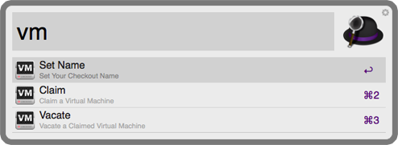

# Alfred Virtual Machine Checkout
 A Workflow that adds [TSM-vm-checkout](https://github.com/Threespot/TSM-vm-checkout) functionality to Alfred 2.

[__Download__](http://cl.ly/0F2J24172e0c)

## Quick Start
1. [__Set__](#set-name--reset-name) - `set` to set your VM checkout name
2. [__Claim__](#claim) - `claim` to search all avaliable vm which can be claimed  ([__bonus__](#claim-cmd))
3. [__Vacate__](#vacate) - `vacate` to search all personally claimed vms

## Commands

### VM
`vm` Shows all VM checkout workflow actions. 
### Set Name / Reset Name
`set` Allows the user to either set or reset their VM checkout name that is used to claim vms. This creates a simple txt document containing the user provided name.
### Claim 
`claim` Search the server for available vms.  Selecting a result sends a request to the server which claims the machine and the user is notified that they now own that vm. 
#### Claim (cmd)
Holding down `cmd` will open Remote Desktop Connection Application and the claimed VM name will be pasted into the prompt.
### Vacate 
`vacate` Searches the server for the users claimed vms. Selecting a result sends a request to the server to vacate the vm.
If you have more than one vm checked out, a 'Vacate All VMs' result will be shown that allows you to vacate all your claimed vms at once (*great for when you've got a couple vms claimed and you're signing off for the day*).

## Things To Do:
- Do some tests and stuff.
- See who has what - check to see who has a vm that you want.
- 'Claim/Vacate' if no name is set request one (already available), launch intend alfred function claim or vacate.
- &#x2713; Open Remote Desktop Connection when claiming a VM
- &#x2713; Copy VM name to clipboard for easy pasting into the RDC
- 'VM' & 'Vacate' - provide result to take user to the VM Checkout page for manual administrating 

## Known Issues

Regardless of what action the user cues in Alfred, if no vm checkout name has been set the user will be prompted to set one first. This interferes with the ability launch RDC when claiming a machine.  I was trying to avoid this; however, a solution is to notify the user with an error message. For example:  "Your VM checkout name is not set, please run 'Set Name'").  RDC will still open when a name has been set.  
